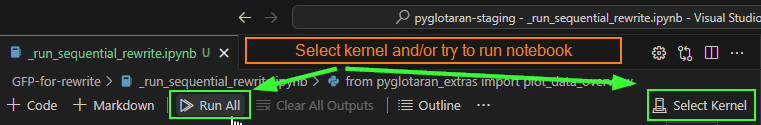
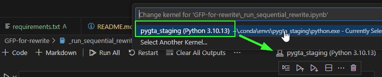
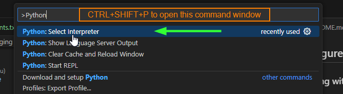

# pyglotaran-staging
A temporary repository to organize various dependent repositories/packages for testing and development of the staging/rewrite branch


## Introduction

This is a collection of packages used in the development and testing of a (partial) rewrite of pyglotaran.

## Setup environment

Create a new conda environment for this collection of packages

```shell
conda create --name pygta_staging python=3.10
conda activate pygta_staging
```

Now assuming we're in the right pygta_staging environment, lets use pip to install the packages from this repository

```shell
pip install -r requirements.txt  # installs pyglotaran and pyglotaran-extras from sources
```

## Configure VS Code

### Working with notebooks (*.ipynb)

Open a notebook from the `GFP-for-rewrite` folder in this repository.

When running a command in the notebook, VS Code will ask you to select a kernel.



Select the newly created `pygta_staging` kernel environment.




### Working with python scripts (*.py)

Execute the VS Code command (CTRL+SHIFT+P) `Python: Select Interpreter` and select the `pygta_staging` environment.


