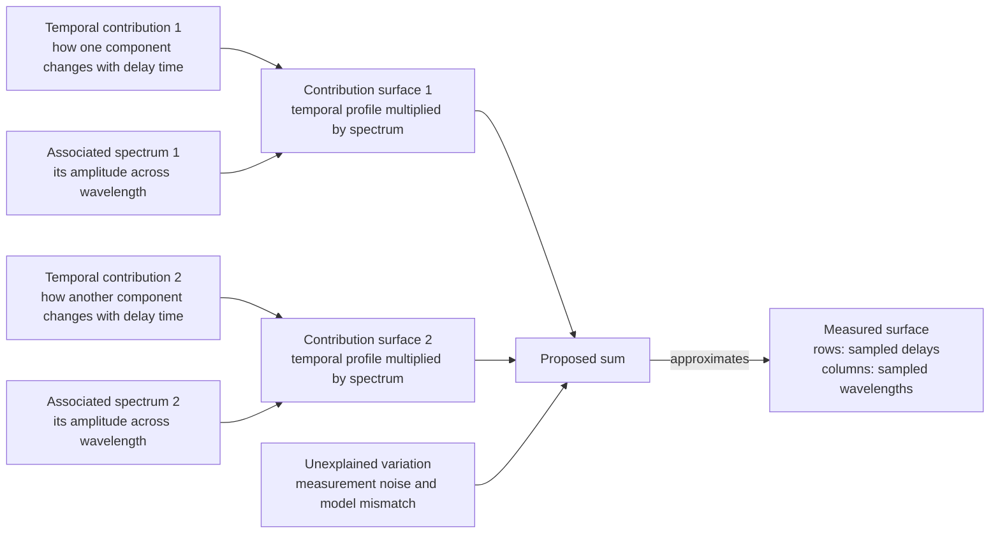
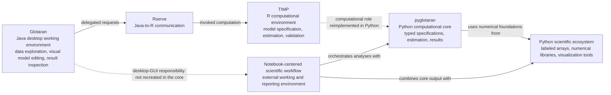
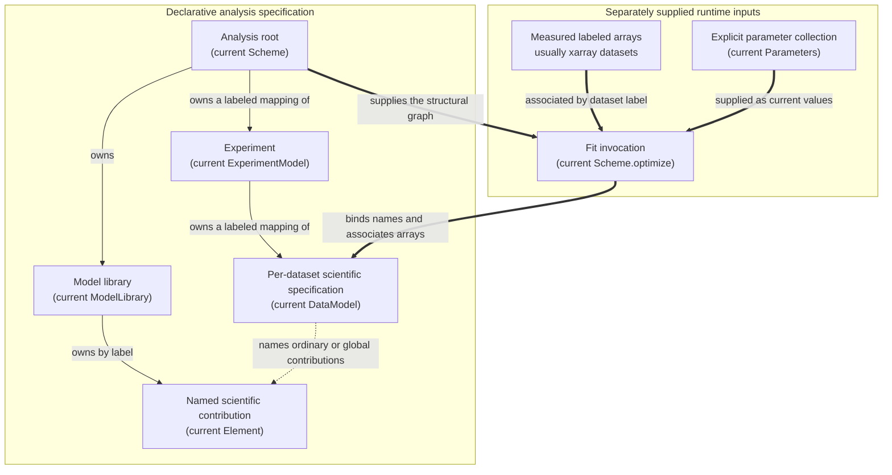
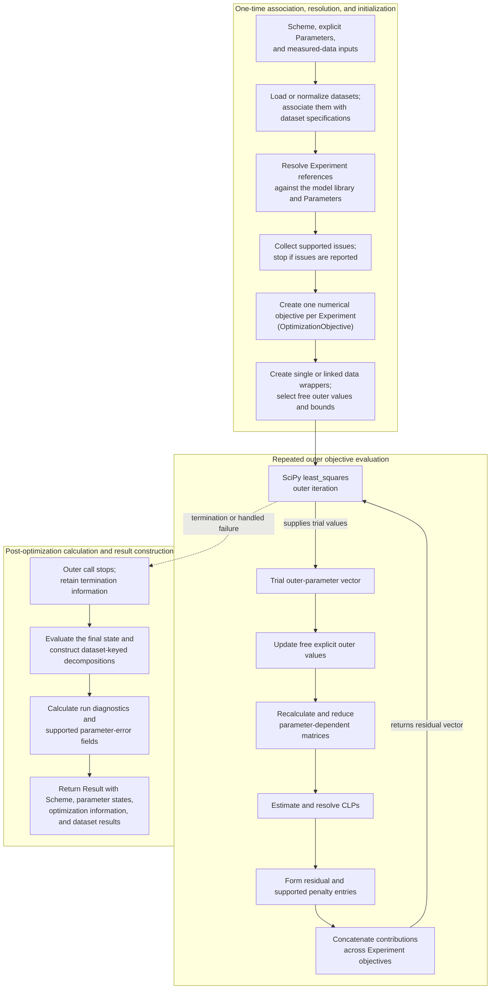
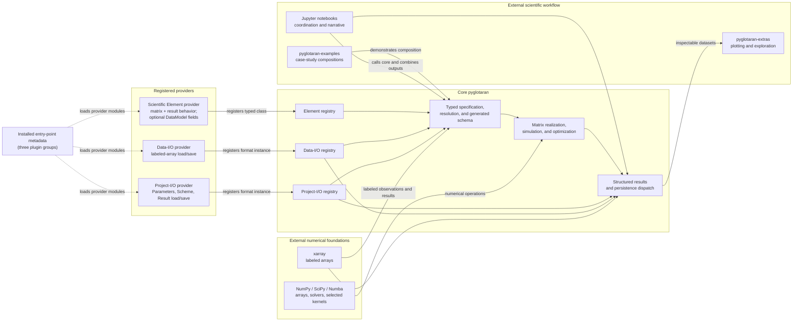

# The architecture of pyglotaran: A composable framework for global and target analysis

## 0. Scope

This chapter argues that the inspected staging architecture supports the cycle of scientific
model discovery by dividing the work into explicit responsibilities. The account is
architectural rather than a user tutorial. Present syntax, class names, and runtime behavior
are based on pyglotaran revision `468c4cd57aaf25c10edf85cd197df771bad0a766` in the inspected
`0.8.0.dev0` staging workspace, with focused tests and staging-compatible examples used as
corroboration. The 2023 paper describes scientific aims, history, and a v0.7-era design; it is
not used as authority for current syntax or class names (van Stokkum et al., 2023). No claim is
made here about future interfaces, compatibility, performance, or unreleased behavior. Jupyter
is treated as an external scientific working environment, and most plotting and higher-level
exploration are assigned to the companion `pyglotaran-extras` package rather than the core.

## 1. From a measured surface to a scientific analysis

### 1.1 What the experiment measures

A pump–probe experiment begins when a short *pump* pulse initiates a change in the sample.
After a chosen delay, a weaker *probe* measurement records the response across many
wavelengths. Repeating the probe at successive delays stacks the spectra into a surface. In
the running example, its rows correspond to sampled delay times \(t_i\), and its columns to
sampled wavelengths \(\lambda_j\). The experiment may contain thousands of such values
even when the scientific question concerns only a few states or processes. Time-resolved
spectra are an important instance of this broader class of multidimensional measurements
(van Stokkum et al., 2004).

The surface does not display a mechanism directly. If two excited states change on similar
time scales and absorb or emit over overlapping wavelength ranges, their signals appear
together at the same measured points. Instrument response, baseline offsets, measurement
noise, and an incomplete scientific hypothesis can add further structure. The task is an
inverse problem: the researcher observes the combined response and asks which smaller set of
processes could have produced it (van Stokkum et al., 2004).

A useful first hypothesis is that each contribution has two parts. Its *temporal
contribution* describes how its strength changes with delay, while its *associated spectrum*
describes how strongly it appears at each wavelength. With two contributions, the signal at
one point can be understood as the first temporal value multiplied by its spectral value,
plus the corresponding product for the second contribution, plus unexplained variation.
Repeating this construction over all sampled points gives two contribution surfaces whose
sum approximates the observed surface. Figure 1 shows this idea.

**Figure 1. A separable modeling hypothesis for a time-by-wavelength observation.** Arrows
from each profile and spectrum denote multiplication into a contribution surface; arrows
from the two surfaces and unexplained variation denote addition; the final arrow denotes
approximation of the measurement.

Separability is a modeling assumption rather than a property established merely by
recording two axes. Wavelength-dependent instrument behavior can modify temporal shapes,
and different combinations of profiles and spectra can sometimes reproduce the same
observations. The latter difficulty is *identifiability*: whether the available measurements
can distinguish the quantities or alternative explanations being estimated. Additional
experiments, scientifically justified restrictions, or more detailed measurement assumptions
may be needed. Even an excellent numerical fit does not by itself identify a unique physical
mechanism (van Stokkum et al., 2004).

This distinction also clarifies two meanings of *model*. A *physicochemical model* is the
scientific hypothesis about states, transitions, spectra, and instrument effects. A *model
for the observations* is wider: it combines that hypothesis with assumptions about how the
measurements are organized and how unexplained variation is treated. Pyglotaran ultimately
needs both kinds of information, although no single software object represents the whole
model for the observations.

### 1.2 Global analysis, target analysis, and model discovery

Fitting is not the endpoint. A proposed explanation must be confronted with the full
measurement and revised when its remaining structure or physical interpretation is
inadequate. *Global analysis* supports that comparison by analyzing measurements
simultaneously under shared model structure. For example, temporal behavior may be estimated
from all wavelengths rather than by fitting each wavelength independently (van Stokkum et
al., 2004).

*Target analysis* asks a more specific question: whether a proposed physicochemical model
can account for the observations and yield interpretable states, rates, or spectra. A kinetic
scheme might specify which states interconvert, while spectral or instrument assumptions add
other parts of the observation model. Global and target analysis are therefore not competing
buttons or separate optimizer modes. They describe different levels of scientific
commitment: simultaneous fitting can begin with flexible temporal components, whereas
target analysis places a more explicit mechanism under test (van Stokkum et al., 2004).

Both strategies belong to an iterative process of scientific model discovery. A researcher
first specifies a candidate explanation, estimates its unknown quantities, and then validates
the result. Validation includes more than checking one error number: residual patterns,
parameter precision, agreement with prior knowledge, and the physical plausibility of fitted
contributions can all motivate revision. TIMP described this as a cycle of model formulation,
fitting, and validation, and the 2023 pyglotaran account retained the same scientific
organization (Mullen & van Stokkum, 2007; van Stokkum et al., 2023).

### 1.3 Lineage of responsibilities

The lineage is best understood by following responsibilities rather than product names.
TIMP supplied an R-based computational environment for multiway spectroscopy. It supported
model specification, parameter estimation, validation, and extensibility within the
interactive model-discovery cycle (Mullen & van Stokkum, 2007).

Glotaran added a Java desktop working environment around that computational capability. It
provided interactive data exploration, assisted model construction, and result viewing, but
delegated the numerical work to TIMP. Communication between the Java application and R used
Rserve, a server interface through which another program could request R computations.
Glotaran was therefore a graphical front end to TIMP rather than a replacement for its
computational core (Snellenburg et al., 2012).

Pyglotaran was subsequently developed as a complete Python rewrite of the Glotaran/TIMP
computational core. The desktop graphical interface was not recreated as part of that core.
Instead, notebook-centered work and the wider Python ecosystem became the surrounding
environment for combining analysis, narrative, and visualization. The published 2023 account
documents this predecessor lineage and ecosystem shift (van Stokkum et al., 2023).

**Figure 2. Responsibility-centered lineage from TIMP and Glotaran to pyglotaran.** Solid
arrows denote run-time use or orchestration. Dashed arrows denote a historical transfer or
reimplementation of responsibility, not continuity of an application programming interface.

## 2. Separating scientific definitions from execution

### 2.1 Why divide the package into responsibilities?

A researcher needs to change a scientific hypothesis without rebuilding data loading,
optimization, and result inspection for every new contribution. In the running example, a
first analysis might describe two independent temporal decays. A later analysis might replace
them with states connected by a kinetic scheme, add an instrument-response contribution, or
analyze a second measurement jointly. These changes alter the scientific explanation, but
they do not remove the need to associate labeled observations, estimate unknown quantities,
and inspect residuals. An architecture that couples all of those tasks in one procedure would
make every scientific revision a software revision.

Pyglotaran addresses this composition problem by letting the researcher state *what* belongs
to an analysis separately from the changing numerical state of one fit. Such a
*declarative specification* records named scientific definitions and their relationships
without prescribing a line-by-line execution sequence. It can be inspected or serialized
before measurements and current parameter values are supplied. The distinction is not
absolute isolation: an in-memory dataset specification can hold a data-source association or
a loaded array. A definition of which contributions apply to a dataset is not the same thing
as the observed values.

Named definitions also permit reuse. A kinetic contribution can be defined once in a model
library and referenced by several dataset specifications. An experiment can coordinate
several such datasets without duplicating the shared definition. Current global- and
target-analysis examples use the same overall structure—library, experiments, datasets, and
element references—while changing the scientific definitions and restrictions inside it.
Global and target analysis are therefore compositions of scientific structure, not separate
architecture roots. The modular reuse has an earlier published rationale (van Stokkum et al.,
2023).

Reuse requires a common boundary between scientific contributions and numerical machinery.
In the inspected implementation, different `Element` types implement a shared responsibility:
given a resolved per-dataset specification and relevant coordinates, they can provide labeled
matrix content; they can also construct contribution-specific result data. The central
estimator can therefore depend on a common contribution contract rather than on the internal
scientific fields of every kinetic, spectral, or instrumental component.

Core pyglotaran owns typed analysis specifications, explicit-parameter handling, reference
binding, numerical realization, optimization, simulation, results, and extension registries.

These boundaries make scientific definitions more reusable and the specification more
inspectable, but they move complexity into coordination. Labels must be connected to the
objects and parameters they denote; compatible contribution types must be determined; and
incoherent combinations should be reported before numerical estimation.

### 2.2 A network of connected scientific definitions

Before a fit can run, the package needs a coherent description of what is shared, what
belongs to one experiment or dataset, and which scientific contributions each dataset uses.
The ordinary idea is a network of named definitions and references. In software terminology,
this is an *object graph*: objects are the nodes, while ownership and reference relationships
are the edges. A YAML document or Python dictionary can describe the network, but it is only
one serialized representation. The running program instantiates typed objects whose
responsibilities and validity rules are not conveyed by indentation alone.

The root of this graph is the analysis specification represented by `Scheme`. Its principal
structural fields are a mapping of experiments and a `ModelLibrary`. The root gives these
parts a common scope and supplies the user-facing optimization entry point, but it is not a
universal container for measured arrays and current parameter values.

The model library owns scientific definitions by label. Each value is a typed `Element`, so
a short name such as `parallel` or `target` can refer to a complete contribution definition.
Labels allow the same definition to be referenced without copying its fields into every
dataset specification. Some element types also support library-level extension: a new
definition names one or more existing definitions and supplies additions or overrides.
This relationship composes scientific configurations. It is distinct from Python class
inheritance, which relates software types rather than user-defined scientific instances.

An experiment is the joint-analysis boundary represented by `ExperimentModel`. It owns a
labeled mapping of one or more dataset specifications and holds configuration that applies
to their coordinated analysis. The name *Experiment* is architectural: it need not imply
that every contained array was acquired in one physical run. It says that the dataset
specifications are intended to participate in one joint analysis.

Each entry in the experiment's dataset mapping is a `DataModel`. Despite the familiar word
*data*, this object is a per-dataset scientific specification, not the measured numerical
array. It identifies ordinary `elements`, may identify `global_elements`, and can contain
typed settings contributed by those elements, together with scales, weights, and a data
source association.

At runtime a data model may carry a source reference or an associated labeled array. The
fit entry point loads or normalizes separately supplied datasets and associates them with
matching specifications before optimization starts; loading a serialized specification can
also follow a stored source reference.

An `Element` is the smallest common scientific contribution in this graph. Its concrete type
determines which scientific fields it carries, while its shared interface allows the
numerical path to ask for labeled matrix content and later for element-specific result data.
An element can also declare additional fields required in a compatible data model. This
allows heterogeneous contributions to extend the scientific vocabulary while retaining one
dataset-specification boundary.

Measured arrays and explicit parameter values stand beside this declarative graph. The
method `Scheme.optimize(parameters, datasets, ...)` requires both as arguments. Measured
arrays are matched to dataset labels, while named explicit parameters are connected to
parameter-bearing fields during resolution. For the static graph, the important invariant is
that `Parameters` holds explicit parameters and does not contain conditionally linear ones.

**Figure 3. Static analysis object graph and separately supplied runtime inputs.** Solid
arrows denote ownership, dashed arrows denote a stored name or scientific reference, and
thick arrows denote association or binding at the fit boundary.

Conflating these edges would hide whether a value is reusable definition, per-dataset
configuration, or changing runtime state. Table 1 summarizes the same graph by
responsibility.

**Table 1. Core entities and responsibilities in the inspected staging architecture**

| Entity | Owns | References | Produces or enables | Invariant or boundary |
|---|---|---|---|---|
| Analysis root (`Scheme`) | Experiment mapping; model library | Optional source path | Typed construction and the fitting entry point | Its structural graph does not replace separately supplied datasets and parameter values |
| Model library (`ModelLibrary`) | Elements keyed by label | Other library labels in supported extension chains | Reusable, extension-resolved element definitions | Cyclic extension chains are rejected during library construction |
| Experiment (`ExperimentModel`) | Dataset specifications and joint-analysis configuration | Parameter labels in applicable settings | A resolved copy for one joint numerical objective | Every dataset label maps to a per-dataset specification |
| Data model (`DataModel`) | Per-dataset scientific configuration and optional data association | Ordinary and optional global element labels; parameter labels | A typed, resolved dataset specification | It is not the measured xarray dataset |
| Element (`Element`) | Contribution-specific scientific fields and constraints | Explicit parameter labels and, for extendable types, library labels | Labeled matrix content and element-specific result data | Concrete types implement the common contribution and result interfaces |
| Measured data | Labeled observed values and coordinates | Dataset label/source metadata | Numerical observations once associated | Supplied or loaded separately from the scheme's structural fields |
| Explicit parameter collection (`Parameters`) | Named explicit parameter objects and metadata | Expression dependencies among parameters | Current values for bound parameter fields | It contains explicit parameters, not conditionally linear coefficients |

### 2.3 Connecting names and checking meaning

Human-readable labels are useful only if the runtime can connect each one unambiguously and
report incoherent relationships. A stored type name first selects a registered concrete
class with defined fields and behavior. Constructing those concrete objects is *typed
instantiation*: a serialized mapping becomes a model library, Experiments, DataModels, and
Elements rather than remaining an untyped dictionary.

The library context matters because an Element type can contribute specialized per-dataset
fields. The constructor examines the ordinary and global Elements named by a dataset,
combines their declared capabilities, and validates the resulting typed DataModel.

Library extension labels are connected during `ModelLibrary` construction. The
implementation repeatedly selects definitions whose dependencies have already been
resolved, combines their parent definitions with the local definition, and stores the
result under the local label. If no remaining dependency can be resolved, the library raises
a cyclic-dependency error. This is reference-based composition among Element instances, not
inheritance among Python classes.

Execution requires a second kind of connection: connecting a stored name to the Element or
explicit parameter it denotes. This is *reference resolution*, or *binding*. Resolution
replaces Element labels with library objects and recursively binds parameter-bearing fields
in a copied Experiment. Returning copies preserves the reusable declarations while giving
numerical initialization objects whose references point to current runtime values.

Parameter binding also limits which explicit parameters participate. Optimization starts
with an empty internal collection, copies a named parameter when a scientific field refers
to it, and recursively adds expression dependencies. In the running example, an Element can
name a temporal rate field, and binding connects that label to the matching explicit
`Parameter`; unrelated entries from a larger parameter file need not participate.

Typed construction and binding can reveal several kinds of incoherence. Declared field
types reject malformed or unexpected values. A missing explicit-parameter reference fails
during binding. After resolution, a separate issue pass reports supported conditions such
as incompatible or non-unique Element combinations; extension cycles fail earlier during
library construction. All of these failures precede numerical objective construction. Their
scope is limited: they establish supported structural and semantic conditions, not the
scientific adequacy of a physicochemical model.

After these operations, names have types and referents, but there is still no fixed numerical
matrix. Element matrix calculation requires measured coordinates and current parameter
values. Table 2 consolidates the terms introduced so far. Current classes remain
implementation anchors rather than definitions of the science.

**Table 2. Terminology concordance**

| Scientific or architectural term | Meaning in this chapter | Current implementation anchor | Common confusion to avoid |
|---|---|---|---|
| Physicochemical model | Hypothesis about states, kinetics, spectra, instrument effects, and related physical structure | Realized through configured Elements and relationships | It is narrower than the complete model for the observations |
| Model for the observations | Physicochemical and measurement assumptions, data organization, and unexplained-variation description used to predict observations | Spans DataModels, Elements, numerical transformations, and residual construction | It is not one Python object |
| Analysis specification | Declarative network of Experiments and reusable scientific definitions | Rooted in `Scheme` | It does not by itself replace measured arrays and current parameter values |
| Model library | Named reusable contribution definitions and supported extension relationships | `ModelLibrary` | It is more than a YAML dictionary |
| Element | Composable scientific contribution with a common matrix-related contract | `Element` subclasses | It need not correspond one-to-one with a physical species |
| Experiment | Joint-analysis grouping of one or more dataset specifications | `ExperimentModel` | It is not an array axis or necessarily one acquisition event |
| Data model | Per-dataset scientific specification and data association | `DataModel` or an Element-contributed subtype | It is not the measured xarray object |
| Measured data | Labeled observed values and coordinates | Usually an xarray dataset supplied or loaded separately | It does not define which scientific contributions apply |
| Reference resolution | Connecting a name to the Element or explicit parameter it denotes before numerical work | Experiment, DataModel, and item-resolution helpers | It is not compilation and does not construct a permanent matrix |

## 3. Giving observations and unknowns numerical roles

### 3.1 Measured arrays are not data models

A table of signal values becomes useful for scientific estimation only when each axis has a
meaning. In the running pump–probe example, a value belongs to a particular delay time and
wavelength; exchanging those axes would change how a numerical routine should read the same
block of numbers. Pyglotaran therefore works with xarray, a labeled-array library that stores
dimension names and coordinate values alongside the numbers. A measured array can enter as
an `xarray.DataArray` or an `xarray.Dataset`. The preparation boundary can turn a DataArray
into a Dataset whose variable named `data` contains the observations, while the coordinate
labels remain available for later interpretation.

Those observations must remain distinct from the scientific instructions for using them. A
data model states which scientific contributions apply to one dataset and can configure
element scales, weights, optional global contributions, and a residual-function field.

The labels also determine two coordinate *roles*. The **model dimension** is the coordinate
along which a model matrix is evaluated. The **global dimension** is the coordinate across
which conditionally linear contributions are organized or estimated. In the running example,
delay time has the model role and wavelength has the global role. These are not universal
synonyms. Another element may calculate a matrix along a different physical coordinate, and
“global dimension” names an axis role rather than the scientific method called global
analysis.

For the ordinary two-dimensional path, the contributing elements declare their model
dimension and must agree on it; the other dimension of the measured `data` variable is
inferred as global. The numerical wrapper then obtains both coordinate arrays by name. If the
stored dimension order is the reverse of model-then-global, it transposes a copy before
estimation. Thus a file need not happen to store time along its first memory axis for time to
serve as the model dimension.

Orientation is followed by *slicing*: exposing the data in pieces suited to the calculation.
In the usual path, each global coordinate supplies one vector along the model axis. For the
spectroscopy example, the inner calculation therefore receives one time trace at each
wavelength. Some supported contribution types instead use one combined, flattened layout.

A **weight** changes how strongly selected observations influence the mismatch being fitted.
Weights can be supplied as an xarray variable or constructed from values assigned to
intervals of the model and global coordinates. The numerical wrapper multiplies the observed
values by these factors, while matrix construction applies matching factors to the calculated
contributions. A factor greater than one therefore makes a discrepancy count more strongly;
a factor below one reduces its influence.

A **scale** answers a different question. It changes the magnitude of a calculated
contribution or dataset block, rather than directly specifying how residual entries are
judged. A data model can scale an individual element contribution, and a multi-dataset
Experiment can scale a dataset's matrix block before linked blocks are joined. Some scales
may themselves refer to explicit parameters. Keeping “scale” and “weight” separate is
scientifically useful: the former belongs to the prediction being compared, whereas the
latter changes the relative influence of discrepancies.

### 3.2 Joint organization across datasets

Related measurements can constrain a scientific explanation more strongly than either
measurement alone. For example, two pump–probe datasets collected under different conditions
may share temporal contributions while differing in sampling, amplitude, or coverage. The
multi-dataset literature treats such shared and dataset-specific quantities as choices that
must be stated by the scientific model rather than assumed from file layout (Mullen & van
Stokkum, 2007). In current pyglotaran, an Experiment is the grouping within which one or more
named dataset specifications can be estimated jointly.

Joint estimation first requires the package to decide which global-coordinate values are
comparable. Two spectrometers might report nominally corresponding wavelengths as 500.0 and
500.1 nm, for example. **Alignment** is the numerical act of mapping such coordinate values
onto a common set. A configured **tolerance** gives the largest permitted separation.
Configuration names `nearest`, `backward`, and `forward` matching policies. These names
express intended selection rules rather than claims that two observations have identical
scientific content. The inspected `forward` implementation does not reliably preserve the
index of its filtered candidate, so its directional behavior is a maintainer-review issue
and is not treated here as a current guarantee.

The inspected linking path builds the union of aligned global coordinates and records which
datasets contribute at each one. If two source coordinates would map ambiguously to the same
target, alignment raises an error rather than silently combining them. At a shared wavelength,
the model-axis vectors from the participating datasets are concatenated into one numerical
block. At a wavelength observed by only one dataset, only that dataset's vector is present.
Configured dataset scales are applied to the corresponding matrix blocks. Consequently,
linking preserves gaps in coverage rather than inventing missing observations.

This distinction is reflected in two numerical representations. An objective with one
dataset uses `OptimizationData`, which supplies its axes, weights, and coordinate-wise data
vectors. An objective with several datasets uses `LinkedOptimizationData`, which additionally
records aligned coordinates, participating-dataset combinations, source indices, block
sizes, and dataset scales.

Alignment alone does not establish that quantities should be shared. That decision comes
from common CLP labels, configured relations, element definitions, and other model choices
discussed in Section 4.

### 3.3 Explicit parameters and conditionally linear coefficients

Some unknown quantities determine the shapes calculated by a scientific contribution,
whereas others only choose how much of each already-calculated shape is present. In the
running example, a decay-rate constant changes a temporal profile. Once that profile is
known, its amplitude at one wavelength can be found by an ordinary linear combination. This
computational distinction motivates two separate representations rather than one
undifferentiated list of “fit parameters”.

An **explicit parameter** is a named, serializable quantity whose current value is supplied
to the scientific definitions. The `Parameter` representation includes metadata such as
whether the value may vary, finite lower or upper bounds, an optional expression, a
positivity setting, and a standard-error field. `Parameters` is the collection that holds
these objects by label. A **free** explicit parameter is selected for the outer optimizer; a
**fixed** one retains its supplied value.

An **expression-defined** parameter is calculated from other explicit parameters. The
implementation marks it as non-varying and updates its value when the independent values
change. It is therefore present in `Parameters` and can be referenced by a scientific
contribution, but it does not occupy an independent position in the outer vector. Bounds,
meanwhile, accompany free values sent to the outer least-squares routine.

The `non_negative` setting on an explicit parameter deserves careful wording. In the
inspected implementation it uses a logarithmic coordinate during optimization and
exponentiates the trial value on return. It is thus a supported positivity transformation,
not simply a zero lower bound. It is also unrelated to non-negative least squares for the
inner coefficients, which Section 4 introduces separately.

A **conditionally linear parameter (CLP)** is one of those inner coefficients. It is
conditional because it can be estimated by a linear or constrained-linear calculation once
the current explicit parameters have fixed the matrix shapes. CLPs are represented through
ordered matrix-column labels and inner-estimation arrays. They are not stored as `Parameter`
objects, do not appear in `Parameters`, and are not independently supplied to the outer
optimizer.

Calling a free explicit parameter an **outer parameter** describes where the software
estimates it. It does not claim that every such quantity is intrinsically nonlinear in every
possible scientific reformulation. Conversely, a CLP may have direct physical meaning—such
as an associated spectral amplitude—even though its computational role is linear after the
shapes are fixed. The categories concern estimation structure, not scientific importance.

For the two-contribution example, the rate constants and instrument-response quantities can
be explicit outer parameters because they determine the temporal profiles. The two spectral
amplitudes at each wavelength are CLPs because, for fixed profiles, they enter as
multipliers.

## 4. Exploiting conditional linearity during estimation

### 4.1 From two contributions to a matrix model

Once explicit parameters have fixed the temporal shapes in the running example, estimating
their wavelength-dependent amplitudes becomes a linear-combination problem. Suppose two
contributions have temporal profiles \(c_1\) and \(c_2\), while \(s_1\) and \(s_2\) describe
their associated spectral amplitudes. At sampled delay \(t_i\) and wavelength
\(\lambda_j\), the modeling assumption is

\[
y(t_i,\lambda_j)\approx
c_1(t_i;\boldsymbol{\theta})s_1(\lambda_j)
+c_2(t_i;\boldsymbol{\theta})s_2(\lambda_j)
+\varepsilon_{ij}.
\]

Here \(i=1,\ldots,n_t\) indexes sampled delays, \(j=1,\ldots,n_\lambda\) indexes
wavelengths, and \(y(t_i,\lambda_j)\) is one measured signal. The vector
\(\boldsymbol{\theta}\) contains the free explicit outer parameters that determine the
profiles, while \(\varepsilon_{ij}\) collects measurement noise and model mismatch not
explained by the two contributions.

For the running example, if the same temporal-shape matrix applies at every wavelength,
stacking all measured values gives the convenient full-surface form

\[
\mathbf{Y} =
\mathbf{M}(\boldsymbol{\theta})\mathbf{B}
+\boldsymbol{\varepsilon}.
\]

The oriented observation
\(\mathbf{Y}\in\mathbb{R}^{n_m\times n_g}\) has \(n_m\) model-dimension samples and
\(n_g\) global-dimension samples. The matrix
\(\mathbf{M}(\boldsymbol{\theta})\in\mathbb{R}^{n_m\times k}\) contains \(k\) effective
shape columns, while \(\mathbf{B}\in\mathbb{R}^{k\times n_g}\) contains the
conditionally linear parameters (CLPs). The unexplained term has the same shape as the
observation. Here \(n_m=n_t\), \(n_g=n_\lambda\), rows of \(\mathbf{M}\) follow delay
time, and every row of \(\mathbf{B}\) is the spectrum associated with one temporal column.

The runtime also supports matrices that change with global coordinate, linked row blocks,
and a specialized flattened two-coordinate problem. A stable description therefore indexes
each realized inner linear problem by \(u\):

\[
\mathbf{y}_u =
\mathbf{M}_u(\boldsymbol{\theta})\mathbf{b}_u
+\boldsymbol{\varepsilon}_u .
\]

In the ordinary path, \(u\) is one aligned global coordinate within an Experiment objective;
its rows may concatenate several linked datasets. In the specialized global-Element path,
one \(u\) instead represents a flattened surface and a Kronecker-composed matrix. Thus
\(\mathbf{y}_u\in\mathbb{R}^{n_u}\),
\(\mathbf{M}_u\in\mathbb{R}^{n_u\times k_u}\), and
\(\mathbf{b}_u\in\mathbb{R}^{k_u}\) have dimensions determined by that realized solve.

The current implementation preserves the link between these mathematical columns and their
scientific names. `OptimizationMatrix` carries an array, an ordered `clp_axis`, and
applicable coefficient constraints. Each Element returns labels with its matrix contribution.
An element-specific scale can multiply that contribution before compatible matrices are
combined.

Composition is label-aware rather than simple side-by-side concatenation. The combined
matrix uses the union of CLP labels. Contributions with the same label are added into the
same effective column, while new labels create new columns. Index-dependent contributions
can also vary along the global coordinate before one matrix is selected for an inner solve.
Thus \(k_u\) counts effective columns after supported composition and transformation; it is
not necessarily the sum of columns returned independently by every Element.

### 4.2 Inner coefficient estimation

For one trial value of \(\boldsymbol{\theta}\), the temporal or other model-dimension
columns are known. The inner question is then: which coefficient values make those columns
reproduce the observations as closely as possible? The phrase **arg min** means “the
argument—the set of coefficient values—that gives the smallest mismatch.” With weighting
and only the constraints supported by the chosen path, one realized inner problem is

\[
\widehat{\mathbf{b}}_u(\boldsymbol{\theta})
=
\underset{\mathbf{b}_u\in\mathcal{C}_u}{\arg\min}\;
\left\|
\mathcal{W}_u\!\left(
\mathbf{y}_u-\mathbf{M}_u(\boldsymbol{\theta})\mathbf{b}_u
\right)
\right\|_2^2.
\]

The hat marks an estimate. The set \(\mathcal{C}_u\) contains only coefficient restrictions
actually supported by the selected estimator and matrix-reduction path. The operation
\(\mathcal{W}_u\) applies the relevant weights to the difference between observed and
calculated values. The Euclidean norm \(\|\cdot\|_2\) squares vector entries, adds the
squares, and takes the square root. Its square is therefore the sum of squared weighted
discrepancies. Physically, the inner solve chooses the spectral or other amplitudes that best
combine the trial shapes in that realized block.

In the ordinary path, pyglotaran multiplies observations by entry-wise weights when
numerical data are initialized and applies matching weights to matrix contributions when
they are calculated. In a specialized global-element path, weights and data are transposed
and flattened. For linked datasets, participating model-axis vectors and matrix blocks are
joined at each aligned global coordinate, with configured dataset scales applied to their
respective matrix blocks. A single \(\mathcal{W}_u\) captures the shared mathematical
intention without claiming that all cases are implemented as one left-multiplication matrix.

Before the inner solver is called, supported CLP relations and zero/only constraints reduce
the labeled matrix at the global coordinate where they apply. A relation such as “target is
a factor times source” merges the target column into the source column and removes the
dependent target from the reduced problem. A zero or only constraint removes an affected
column where its interval rule applies. After estimation, the runtime expands the CLP vector
back to the full label set, placing zeros or reconstructed related values in their
appropriate positions. These transformations are part of the constraint set
\(\mathcal{C}_u\).

At every outer trial, the default strategy solves the linear coefficients afresh and leaves
them out of the outer search vector. This elimination is **variable projection**. The
staging routine uses an unpivoted QR factorization, which assumes that the reduced matrix has
enough independent rows and a sufficiently well-conditioned, full-column-rank basis. It is
not a rank-revealing fallback for duplicated or dependent columns. The approach is
consistent with the separable-least-squares literature
(Mullen & van Stokkum, 2007; van Stokkum et al., 2004), but it is not described here as a
port of TIMP's partitioned algorithm.

The supported alternative asks for nonnegative coefficients in the reduced inner system;
this is **non-negative least squares (NNLS)**. The current routine delegates that solve to
SciPy's `nnls` and calculates the data-minus-fit residual. Zero/only constraints remain zero
when the full CLP labels are restored, but a relation-reconstructed target inherits its
relation factor and can be negative if that factor is negative. NNLS is therefore a
reduced-system restriction, distinct from the logarithmic positivity transformation for
explicit outer parameters, and its scientific use still requires justification.

### 4.3 Outer least squares, penalties, and uncertainty

The residual left after the inner estimate tells the outer routine how well the current
shape-producing parameters work. The outer routine changes only the free explicit
parameters, respects their supported bounds or positivity coordinates, updates expression
consequences, and asks all objectives to repeat their matrix and CLP calculations. A
schematic objective that includes all realized inner units \(u\) and penalty residuals is

\[
\widehat{\boldsymbol{\theta}}
=
\underset{\boldsymbol{\theta}\in\Theta}{\arg\min}\;
\left\|
\operatorname{concat}_u
\mathbf{r}_u\!\left(
\boldsymbol{\theta},
\widehat{\mathbf{b}}_u(\boldsymbol{\theta})
\right)
\right\|_2^2
+
\left\|\mathbf{p}(\boldsymbol{\theta})\right\|_2^2.
\]

The estimate \(\widehat{\boldsymbol{\theta}}\) is the outer-parameter vector that gives the
smallest represented mismatch within the feasible domain \(\Theta\). That domain includes
applicable bounds and the consequences of fixed, expression-defined, and
positivity-transformed explicit parameters. For each \(u\), \(\mathbf{r}_u\) is the residual
contribution after the inner coefficient estimate. The operator \(\operatorname{concat}_u\)
places those vectors end to end. The vector \(\mathbf{p}\) contains supported soft-penalty
residuals and can depend indirectly on \(\boldsymbol{\theta}\) through the fitted CLPs.

The displayed sum explains the mathematical intention rather than naming a scalar object
constructed by pyglotaran. In the current path, each objective concatenates its data
residuals. The implementation calls one supported condition an *equal-area* CLP penalty,
but its residual is a configured weight times the difference between sums of absolute CLP
samples over selected intervals. It is proportional to a coordinate area only under
additional spacing assumptions. The top-level callback concatenates these entries with the
vectors from all Experiment objectives and gives the result to SciPy's `least_squares`.

The timing of recalculation is also visible here. Numerical data wrappers, aligned
coordinates, and linked-group definitions are created when an `OptimizationObjective` is
initialized. During every callback, trial explicit values are written into the selected
`Parameters`; expression-defined values are updated; element matrices are recalculated and
combined; relations and constraints reduce them; and inner CLPs and residuals are estimated.
The architecture therefore does not prepare all matrices once. Only structures independent
of the changing trial parameters can be initialized ahead of the loop.

SciPy stops according to configured tolerances, evaluation limits, or failure conditions.
The resulting local uncertainty summaries ask how sharply the residual changes near the
reported outer values. The **Jacobian** is the derivative matrix describing that local
change. Its normal matrix, \(\mathbf{J}^{\mathsf{T}}\mathbf{J}\), combines those
sensitivities; directions in which the residual changes little are correspondingly difficult
to determine from the fit. The implementation reports a rank-truncated inverse of this
normal matrix and labels the field `covariance_matrix`, although the stored matrix is not
itself multiplied by a residual variance. A reported **standard error** is intended to
summarize local parameter uncertainty: here it is the root-mean-square residual multiplied
by the square root of the corresponding diagonal entry. For a logarithmically transformed
positive parameter, that error remains in the optimizer coordinate and is not converted to
the exponentiated physical scale.

The reported **degrees of freedom** are intended to compare the amount of residual
information with the number of fitted quantities. In this implementation they are counted
as the complete residual-vector length minus reported outer and CLP counts. Soft-penalty
entries are included in that length. In the specialized global-Element path, the current CLP
count uses the sum of two label-axis sizes although the fitted coefficient array uses their
product. Consequently, degrees of freedom and uncertainty-related fields are current runtime
diagnostics with path-specific limitations, not general statistical guarantees. They warrant
maintainer review before quantitative uncertainty interpretation.

```mermaid
flowchart LR
    subgraph O["Initialized numerical context"]
        Y0["Measured labeled arrays"]
        D["Oriented and weighted data blocks<br/>(OptimizationData or linked form)"]
        RC["Configured relations,<br/>constraints, and scales"]
        PC["Configured penalty definitions"]
        Y0 -->|orient, slice, align, and weight| D
    end

    subgraph E["Repeated objective evaluation"]
        T["Trial explicit outer values<br/>theta"]
        P["Update explicit Parameters<br/>and expression consequences"]
        M["Calculate and combine<br/>labeled element matrices"]
        R["Apply scales and weights;<br/>reduce relations and constraints"]
        I["Inner coefficient estimate<br/>variable projection or NNLS"]
        B["Estimated CLPs and<br/>data residuals"]
        A["Concatenate data residuals<br/>and supported penalty entries"]

        T -->|trial vector| P
        P -->|current values| M
        M -->|matrix columns and CLP labels| R
        RC -->|configured transformations| R
        D -->|observed blocks| I
        R -->|reduced matrices| I
        I -->|solve conditionally linear problem| B
        B -->|residual entries and resolved CLPs| A
        PC -->|soft conditions| A
    end

    L["Outer least-squares routine<br/>(SciPy least_squares)"]
    A -->|one residual vector| L
    L -.->|propose another trial| T
```

**Figure 4. Nested estimation from trial explicit parameters to an outer residual vector.**
Solid arrows carry numerical values or configured transformations. The dashed return arrow
means that the outer least-squares routine proposes another trial.

Relations, constraints, weights, and scales are transformations at particular edges, not a
third optimizer.

**Table 3. Mathematics-to-code concordance for nested estimation**

| Equation symbol or operation | Scientific meaning | Current runtime representation | When it participates |
|---|---|---|---|
| \(u\) | One realized inner linear problem | One global-coordinate slice, one linked coordinate block, or the specialized flattened global-Element problem | Used to define and concatenate residual contributions without assuming one universal layout |
| \(\boldsymbol{\theta}\), \(\Theta\) | Free explicit outer values and their feasible domain | Selected labels/values/bounds from `Parameters`; trial vector handled by `Optimization.objective_function` and SciPy `least_squares` | Updated once per outer callback |
| \(\mathbf{Y}=\mathbf{M}\mathbf{B}+\boldsymbol{\varepsilon}\) | Full-surface separable model when one shape matrix applies across global coordinates | A teaching view of the common-matrix running example | Connects temporal columns to associated spectra; not a universal stored object |
| \(\mathbf{y}_u\) | Oriented observations for one inner problem | A data slice, flattened data, or linked block | Numerical views are initialized before repeated evaluation |
| \(\mathbf{M}_u(\boldsymbol{\theta})\) | Composed shape columns for the current inner problem | `OptimizationMatrix.array`, with its `clp_axis` | Recalculated and transformed during each objective evaluation |
| \(k_u\), matrix-column labels | Number and identities of effective coefficient columns | `OptimizationMatrix.clp_axis` after composition and reduction | Determines the reduced coefficient-vector layout |
| \(\mathbf{b}_u\), \(\widehat{\mathbf{b}}_u\) | CLPs and their current inner estimates | `OptimizationEstimation.clp`, later expanded to full labels where needed | Solved inside each current matrix/data problem; not stored in `Parameters` |
| \(\mathcal{W}_u\) | Relative influence assigned to residual entries | Dataset/model weights applied to observed values and corresponding matrices, including flattened forms | Data side at wrapper initialization; matrix side during calculation |
| \(\mathcal{C}_u\) | Supported restrictions on reduced inner coefficients | Matrix reduction for CLP relations and zero/only constraints; nonnegativity of the reduced vector under NNLS | Applied before or within the inner solve; relation-reconstructed targets inherit their factor |
| \(\mathbf{r}_u\) | Weighted data mismatch returned for outer least squares | `OptimizationEstimation.residual` concatenated by `OptimizationObjective.calculate` | Recomputed for every outer trial |
| \(\mathbf{p}\) | Soft-condition residual entries | Weighted differences between sums of absolute CLP samples for the implemented equal-area condition | Appended to data residuals when configured |
| \(\operatorname{concat}\), \(\|\cdot\|_2^2\) | One vector whose squared entries define the outer least-squares mismatch | NumPy concatenation followed by SciPy `least_squares` | Connects all objectives and penalties to the outer iteration |

## 5. From a resolved specification to evidence for validation

### 5.1 The runtime lifecycle

The same objects play different roles before iteration, during each trial, and after the
optimizer stops. Their ordered passage through those roles is the *runtime lifecycle*.
Here, **initialization** means the one-time work that makes the declared analysis
numerically usable; an **objective evaluation** is one calculation of the residual vector
for a trial set of free explicit parameters; and **post-processing** means the calculations
that package the final state into diagnostics and scientific result structures. Keeping
these phases separate is important because a matrix that depends on a changing rate or
instrument parameter cannot be treated as if it were fixed during initialization.

At the public boundary, `Scheme.optimize(...)` receives three conceptually distinct
inputs: the Scheme, explicit `Parameters`, and measured data or references from which the
data can be loaded. The dataset input is first normalized into a mapping and assigned to
the matching per-dataset specifications. Thus, for the running time-and-wavelength
example, the measured surface is associated with its DataModel before the optimization
orchestrator is created.

Construction of `Optimization` begins the one-time semantic phase. Each Experiment is
resolved against the model library and the supplied initial parameters. During this step,
the explicit parameters referenced by the resolved specifications are collected into an
internal `Parameters` object; a missing parameter reference can stop binding at this point.
The implementation then gathers supported issues from the resolved Experiments and stops
when any are reported. Only after binding and this separate issue pass does it create one
`OptimizationObjective` for each Experiment.
An objective creates either a numerical wrapper for one dataset or a linked wrapper when
the Experiment contains several dataset specifications. Dimension inference, orientation,
weight preparation, and alignment therefore belong to initialization of these wrappers
rather than to every outer trial.

The outer problem is configured from the free explicit-parameter labels, their initial
values, and their bounds. The selected least-squares method and termination tolerances are
also stored before SciPy is called. This free numerical vector is narrower than the
complete serialized parameter collection: fixed and expression-determined values need not
be independent entries. SciPy's `least_squares` routine then controls the outer sequence
of trial values. Pyglotaran supplies the function that translates each trial into the
residual entries expected by that routine.

An objective evaluation begins by writing the trial values back to the internal explicit
parameters. Each Experiment objective then recalculates its Element matrices. The
matrices are reduced according to configured coefficient relations, and the inner
estimator obtains the conditionally linear parameters (CLPs) for the current outer trial.
Where needed for supported CLP penalties, reduced estimates are mapped back to the
corresponding coefficient labels. Residual entries and applicable penalty entries are
combined within the objective. Finally, the contributions from all Experiment objectives
are concatenated into one vector and returned to SciPy.

SciPy uses the returned vector to choose another trial or to stop according to its method,
tolerances, and evaluation limit. Pyglotaran captures the termination message and, when
enabled, the textual iteration report from which an optimization-history table can be
constructed. A clean termination, a small residual, and a physically convincing
interpretation remain different questions.

After the outer call stops, the implementation evaluates the final state again and asks
each objective to construct its results. One objective corresponds to one Experiment, but
the returned `OptimizationResult` objects are keyed by dataset label and combined into
the top-level mapping. This post-processing reconstructs the final matrices, CLPs,
residuals, and contribution-specific datasets needed for inspection. It also determines
counts used in the diagnostic statistics and creates `OptimizationInfo` from the available
SciPy output. Back in `Scheme.optimize(...)`, the supported standard-error calculation
described in Section 4 is assigned to optimized explicit parameters when available. Only
then is the top-level `Result` constructed from the Scheme, initial and optimized
parameters, diagnostics, and dataset-keyed numerical results.

**Figure 5. Runtime lifecycle from declared analysis to structured result.** Solid arrows
show normal execution order and the two numerical directions at the optimizer boundary:
SciPy supplies trial outer values, while pyglotaran returns a residual vector. The dotted
arrow leaves that cycle on termination or a handled failure.

Figure 5 also locates two failure boundaries. Missing or incoherent relationships detected
during binding or the subsequent issue checks prevent numerical objectives from being
created. A failure during the outer call can instead be raised or converted into a
terminated run according to the configured exception behavior, after which the package
still attempts to describe the final available state.

### 5.2 Results, provenance, persistence, and validation

A parameter vector alone cannot show where the fit fails or whether the fitted
contributions make physical sense. The top-level `Result` therefore retains the Scheme,
the initial and optimized explicit parameters, optimization information, and a mapping
from dataset labels to numerical results. Its `input_data` convenience property provides
the measured arrays used for those dataset results. This organization places the final
parameter values beside the analysis specification and observations to which they belong,
rather than presenting them as context-free numbers.

Each dataset-level `OptimizationResult` stores the input array, the residual array when it
is available, Element-result and activation-result mappings, a fit decomposition, and
metadata. Calculated or *fitted data* are obtained as input data minus residuals. For the
running experiment, retaining both surfaces allows a reader to compare measured and
calculated signals across time and wavelength, while the residual surface can reveal
localized temporal or spectral structure that a single scalar error measure would hide.
The metadata identify the model and global dimension names, the applied inter-dataset
scale, the root-mean-square error, and an optional weighted root-mean-square error.
When weights are present, the retained residual is restored to the unweighted measurement
scale. A weighted residual is used transiently to calculate the weighted error metric, but
it is not a separate field of `OptimizationResult`.

The fit decomposition keeps the final CLP array beside the corresponding matrix array. In
the running example these data connect the wavelength-dependent coefficients to the
time-dependent shapes that generated the fitted surface. Separate Element-result datasets
can present contribution-specific quantities in scientifically useful coordinates. For
ordinary Elements, result construction calls the Element's result method and adds an
`element_uid` containing its fully qualified implementation name. This records where that
output came from, a specific form of **provenance**. The specialized global-Element result
path instead assembles its dataset directly and does not add a per-Element UID in the
inspected implementation.

`OptimizationInfo` groups termination and evaluation diagnostics, fit-size statistics, and
the local sensitivity fields qualified in Section 4. Its `ParameterHistory` receives one
initialization snapshot on the inspected optimization path; it is not an iteration-by-
iteration parameter trajectory. `OptimizationHistory` is parsed from captured SciPy text
and can be empty when that text is unavailable.

The result structures can be converted into related files and loaded later; this is
**persistence**. `Result.save(...)` dispatches through a project-I/O provider, while arrays
are serialized through a data-I/O provider. Under the default saving policy, the Scheme,
initial and optimized parameters, histories, input and residual data, calculated data,
fit decomposition, and contribution-specific datasets can be written as a related set of
files. A minimal policy deliberately omits selected derived arrays, so persistence should
not be described as an unconditional archival guarantee. When measured data were loaded
through the I/O layer, their `source_path` and fully qualified `io_plugin_name` attributes
can also be used to retain the relationship to the original source instead of silently
changing its format. Scheme, parameter, and result paths are updated by the corresponding
save/load wrappers where configured.

Serialization also exposes the currently running pyglotaran version through a computed
field. On reload, that value is recomputed from the reader's environment rather than
retained as an immutable creation-version record.

A researcher can inspect residual patterns, compare fitted contributions, consider
parameter precision, and ask whether the recovered temporal and spectral shapes are
compatible with the proposed physicochemical model (van Stokkum et al., 2004). The
architecture makes those questions answerable from structured outputs without automating
the judgment. Result construction closes one estimation cycle by preserving observations,
differences, decompositions, and diagnostics that can motivate the next revision of the
analysis.

## 6. Extending the framework and evaluating its trade-offs

### 6.1 Registered extension surfaces

A common optimizer is useful only if new scientific contributions and file formats can
enter through explicit boundaries. Otherwise, adding a new kinetic contribution or
measurement format would require edits throughout data handling, estimation, and result
construction. Pyglotaran addresses this problem with separate registries: directories
that connect a name to an available implementation. The inspected staging code maintains
one registry for Element classes, one for measured-data input/output (I/O), and one for
project-level I/O. These are related mechanisms, not a single unrestricted plugin API.

Installed packages can advertise provider modules in package metadata. Python calls these
records **entry points**. When pyglotaran is imported, its
loader inspects three groups—for Elements, data I/O, and project I/O—and imports the
declared provider modules. Registration code in those modules then adds implementations
to the appropriate directory. The built-in distribution uses the same mechanism for
scientifically different Elements such as kinetics, baseline, spectral contributions,
coherent artifacts, and damped oscillations, as well as several data and project formats.

A scientific Element provider supplies a subclass that can calculate a labeled matrix
contribution and create its contribution-specific result dataset. It may also declare a
specialized DataModel type. When a serialized dataset specification refers to Elements,
the package combines the corresponding contributed DataModel capabilities into the typed
per-dataset object. A new scientific contribution can thus add both numerical behavior
and the configuration needed to describe it, while the central optimization path
continues to work through matrices, coefficient labels, residuals, and Element results.
This boundary is narrower than allowing an extension to substitute arbitrary optimizer
behavior.

The two I/O surfaces answer different questions. A data-I/O provider translates a
measurement file into or out of an xarray `Dataset` or `DataArray`. A project-I/O provider
loads or saves `Parameters`, Schemes, and Results. Their base interfaces allow a provider
to implement only the operations its format supports, while the public dispatch
functions select a registered format, pass through format-specific options, protect
against accidental overwriting where applicable, and update verified source-path
metadata. Keeping these registries separate prevents a provider for a scientific array
format from implicitly becoming responsible for serializing a complete analysis.

Each registered implementation has a convenient short access name and an unambiguous
**fully qualified registry key**. An Element key is its complete module-and-class path.
Data- and project-I/O providers are instantiated per format, so their full keys append a
format suffix to that path. In the inspected registry, the first provider keeps an occupied
short binding; a conflicting provider remains accessible under its full key and a warning
explains how to choose it explicitly. Deliberately rebinding a short name to the exact full
key shown by its registry is called **pinning**. It resolves that ambiguity without
promising future third-party compatibility.

Registered typing also reaches editor support. The JSON-schema utility constructs a
Scheme schema together with a generated DataModel schema based on DataModel subclasses
loaded in the current process. If explicit parameters are supplied, their labels can be
inserted as allowed references. This **generated schema** can help an editor offer
completion and detect some malformed declarations. It reflects currently loaded types and
does not eliminate runtime reference resolution or scientific issue checking.

**Table 4. Extension surfaces in the inspected staging implementation**

| Registry or interface | Extension supplies | Core-side behavior in inspected staging | Resulting capability |
|---|---|---|---|
| Element registry and `Element` contract | A typed Element class; matrix calculation; contribution-specific result creation; optionally a specialized DataModel type | Resolves the registered type, incorporates contributed dataset fields, composes its matrix through the common numerical path, and adds Element identity to its result dataset | Additional scientific contributions can use the shared optimization and result lifecycle |
| Data-I/O registry and `DataIoInterface` | Load and/or save behavior for one or more measurement-data format names | Dispatches by registered or inferred format, exchanges xarray labeled arrays, and records source path and provider identity on loaded data | Additional measured-data formats can enter without changing scientific Elements |
| Project-I/O registry and `ProjectIoInterface` | Load and/or save behavior for Parameters, Schemes, and Results | Dispatches analysis-object persistence, applies overwrite checks, and updates supported source paths | Additional declarative and result formats can represent a related analysis artifact set |

**Figure 6. Registered extension and surrounding ecosystem boundaries.** Solid arrows
show registration, use, or data flow as labeled; dotted arrows show provider discovery
through installation metadata. The three registries mediate different contracts.
Numerical libraries, notebooks, examples, and extras surround the core rather than
registering alternative outer optimizers.

### 6.2 Simulation and the surrounding scientific ecosystem

The same scientific definitions can generate expected labeled observations before any fit
is attempted. This operation is **simulation**. It takes a DataModel, explicit parameters,
coordinates, and either supplied CLPs or a global Element contribution. The
current `simulate(...)` function resolves the DataModel, determines the model and global
coordinate roles, constructs `OptimizationMatrix` objects, and combines the matrices
with CLPs. It therefore reuses reference resolution and matrix construction from the
analysis architecture but does not invoke the outer least-squares optimizer. For the
running example, simulation can generate a time-by-wavelength surface from chosen
temporal shapes and spectra before measured data are fitted.

Several general-purpose libraries provide foundations beneath this path. xarray carries
labeled observations, coordinates, and result arrays. NumPy supplies array operations.
SciPy supplies the outer least-squares routine, the supported non-negative least-squares
solver, and linear-algebra functions used by numerical components. Numba is used in
selected built-in matrix kernels. These libraries provide numerical capabilities; the
scientific meaning of a rate, spectrum, instrument response, or coefficient relation
comes from the pyglotaran specification and Element implementations.

Tools and repositories can cooperate with the core without belonging to its optimizer;
together they form the surrounding **ecosystem**. Jupyter notebooks can coordinate loading,
analysis calls, explanatory text, and plots in one external working document, a role
emphasized in the published problem-solving-environment account of pyglotaran
(van Stokkum et al., 2023). The `pyglotaran-examples` repository supplies notebook case
studies and current compositions, including fluorescence, transient-absorption,
multi-dataset, and damped-oscillation analyses. Such examples establish intended usage at
the user boundary but do not prove internal runtime behavior. `pyglotaran-extras`
separately supplies plotting and higher-level exploration conveniences.

### 6.3 Verified trade-offs

Separating responsibilities controls one kind of complexity by making other coordination
work explicit. The pairs below are interpretations of the inspected mechanisms, not
performance claims.

First, a declarative network of reusable Elements and dataset specifications makes shared
scientific structure inspectable and avoids repeating definitions. The corresponding
cost is that names must be connected to typed objects, extension chains and parameter
references must be resolved, and supported issues must be checked before numerical work
begins.

Second, plugin-contributed typing lets a scientific extension add configuration fields
alongside matrix behavior. It also means that the available schema depends on the types
loaded in the process. Short names improve readability, but multiple installed providers
can claim the same name, requiring warnings, fully qualified identities, and explicit
pinning.

Third, the separation of explicit outer parameters from CLPs lets heterogeneous
contributions share the nested estimation machinery. The cost is an interface constraint:
an Element must expose its contribution as a compatible labeled matrix so that the inner
coefficient problem remains visible to the common runtime.

Fourth, labeled arrays preserve the meaning of coordinates in observations and results.
At the numerical boundary, however, dimensions still have to be inferred or declared,
oriented consistently, sliced, and—where multiple datasets are linked—aligned according
to configured rules.

Fifth, structured residuals, decompositions, diagnostics, paths, and contribution results
give a researcher more evidence for validation than a final parameter vector would.
Their nested mappings, optional fields, and configurable persistence make the result
structure correspondingly more complex. Consumers must account for what was retained
under the selected saving policy.

Finally, notebook-centered work can combine code, narrative, and many Python tools
without placing an interactive environment inside the optimizer. It does not reproduce
every guided affordance of the historical dedicated desktop interface, and reproducible
use still depends on disciplined recording of inputs and software context.

## 7. Conclusion

The staging architecture is best judged by whether it lets a researcher move from a
scientific question to a traceable numerical analysis without coupling every possible
contribution to a bespoke workflow. Software cannot remove the ambiguity of the inverse
problem. It can, however, keep the assumptions and transformations used to interpret the
surface visible enough to inspect and revise.

Taken together, the separations form a coherent architecture for iterative model discovery:
state a scientific hypothesis, bind it to observations and explicit values, realize and
estimate the corresponding numerical problem, inspect structured evidence, and revise the
hypothesis. That judgment is deliberately limited to the inspected `0.8.0.dev0` staging
source. It is neither a guarantee of scientific identifiability nor a prediction of future
interfaces. Its value lies in making the present route from scientific assumptions to
inspectable numerical evidence explicit enough to question and repeat.

## References

Mullen, K. M., & van Stokkum, I. H. M. (2007). TIMP: An R package for modeling multi-way
spectroscopic measurements. *Journal of Statistical Software, 18*(3), 1–46.
https://doi.org/10.18637/jss.v018.i03

Snellenburg, J. J., Laptenok, S. P., Seger, R., Mullen, K. M., & van Stokkum, I. H. M.
(2012). Glotaran: A Java-based graphical user interface for the R package TIMP. *Journal of
Statistical Software, 49*(3), 1–22. https://doi.org/10.18637/jss.v049.i03

van Stokkum, I. H. M., Larsen, D. S., & van Grondelle, R. (2004). Global and target
analysis of time-resolved spectra. *Biochimica et Biophysica Acta, 1657*, 82–104.
https://doi.org/10.1016/j.bbabio.2004.04.011

van Stokkum, I. H. M., Weißenborn, J., Weigand, S., & Snellenburg, J. J. (2023).
Pyglotaran: A lego-like Python framework for global and target analysis of time-resolved
spectra. *Photochemical & Photobiological Sciences, 22*(10), 2413–2431.
https://doi.org/10.1007/s43630-023-00460-y
